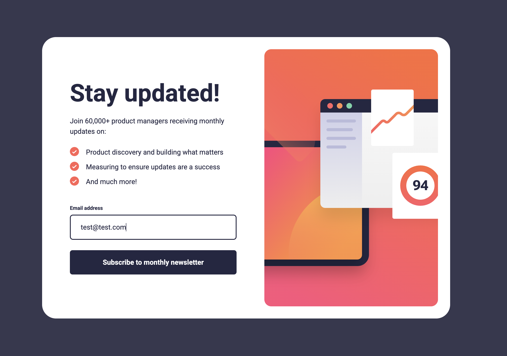

# Frontend Mentor - Newsletter sign-up form with success message solution

This is a solution to the [Newsletter sign-up form with success message challenge on Frontend Mentor](https://www.frontendmentor.io/challenges/newsletter-signup-form-with-success-message-3FC1AZbNrv).

## Table of contents

- [Overview](#overview)
  - [The challenge](#the-challenge)
  - [Screenshot](#screenshot)
  - [Links](#links)
- [My process](#my-process)
  - [Built with](#built-with)
  - [What I learned](#what-i-learned)
  - [Useful resources](#useful-resources)
- [Author](#author)

## Overview

### The challenge

Users should be able to:

- Add their email and submit the form
- See a success message with their email after successfully submitting the form
- See form validation messages if:
  - The field is left empty
  - The email address is not formatted correctly
- View the optimal layout for the interface depending on their device's screen size
- See hover and focus states for all interactive elements on the page

### Screenshot

### Links

- Solution URL: [Gihub repository](https://github.com/samulikn/newsletter-signup)
- Live Site URL: [Live site](https://samulikn.github.io/newsletter-signup/)

## My process

### Built with

- Semantic HTML5 markup
- [Tailwind CSS](https://tailwindcss.com/) - CSS framework
- Mobile-first workflow
- Vanilla JavaScript

### What I learned

I built components designed using a mobile-first approach and styled with custom Tailwind CSS variables.

### Useful resources

- [Build adaptive user interface](https://tailwindcss.com/docs/responsive-design) - This helped me to create responsive utility.

## Author

- Website - [Nataliia](https://natashobotova.onrender.com)
- Frontend Mentor - [@samulikn](https://www.frontendmentor.io/profile/samulikn)
